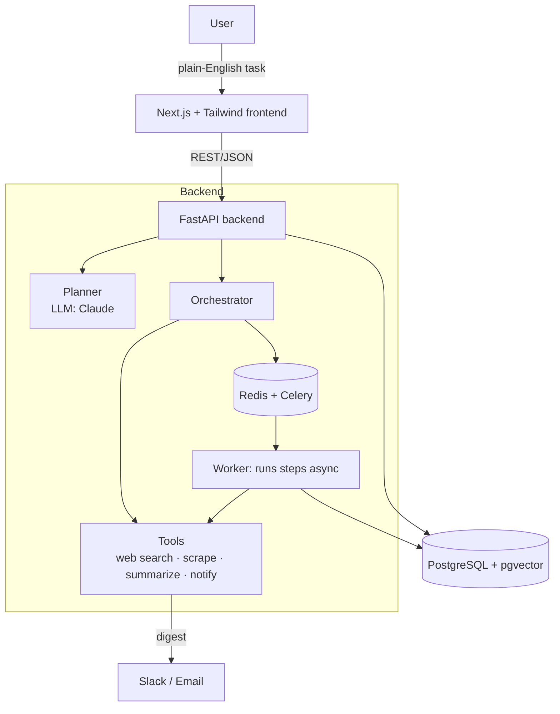

# Architecture

## System overview

> The Redis + Celery worker is the **optional async path** (used by `docker-compose` /
> self-hosting). On the free Render deployment, runs execute **inline** in the API and
> scheduling is driven by an external cron hitting `/api/scheduler/tick` — see
> [how-it-works.md](how-it-works.md).

## Core concepts

- **Workflow** — a user goal, expressed in plain English, plus the structured plan
  derived from it.
- **Step** — one typed unit of work in a workflow (e.g. `web_search`, `summarize`,
  `notify_slack`). Ordered; may depend on prior steps' outputs.
- **Run** — one execution of a workflow. Records status, per-step results, timings,
  and errors. Enables history, retries, and observability.
- **Tool** — a capability the orchestrator can invoke (search, scrape, summarize,
  send). The LLM plans which tools to use; the backend actually executes them.

## Request lifecycle (MVP)

1. User submits a task description.
2. **Planner** (Claude) converts intent → an ordered list of typed steps.
3. Workflow + steps are persisted; user reviews / edits / approves.
4. On run, the **orchestrator** executes steps (sync for MVP, async via queue later).
5. Results are stored per step; the user approves, edits, or rejects.
6. Output steps deliver the result (Slack / email).

## Design principles

- **Human-in-the-loop.** Nothing side-effecting (send, publish) runs without review.
- **LLM plans, code executes.** The model chooses tools and structures data; tool
  execution and side effects live in deterministic backend code.
- **Everything is a Run.** All execution is recorded for history, retries, and eval.
- **Incremental infra.** Runs locally with zero setup, deploys free on Render, and the
  same containers scale on any host (see [deployment.md](deployment.md)).

## Component map

| Component      | Responsibility                                              |
| -------------- | ----------------------------------------------------------- |
| Frontend       | Task input, workflow display/editing, review UI             |
| API (FastAPI)  | REST endpoints, validation, persistence, auth (later)       |
| Planner        | Intent → structured steps via Claude (tool/function schema) |
| Orchestrator   | Executes steps, resolves dependencies, records results      |
| Worker         | Async step execution (Celery), retries, scheduling          |
| Tools          | Web search, scraping, summarization, notifications          |
| Postgres       | Workflows, steps, runs, embeddings (pgvector)               |
| Redis          | Queue broker + result backend (optional async path)         |
| Object storage | Uploaded docs / artifacts — optional, S3-compatible (not wired yet) |
