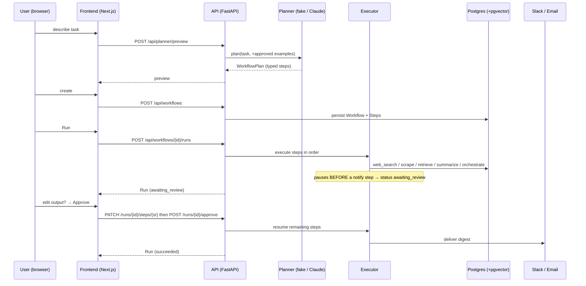
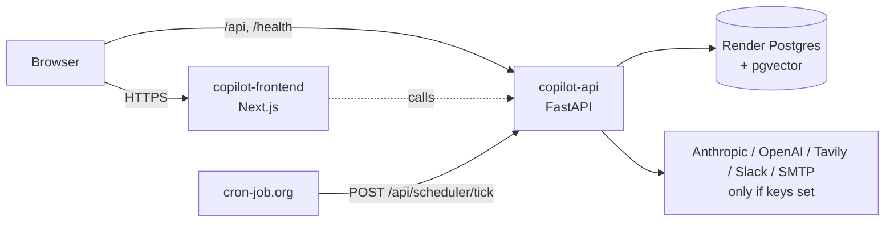
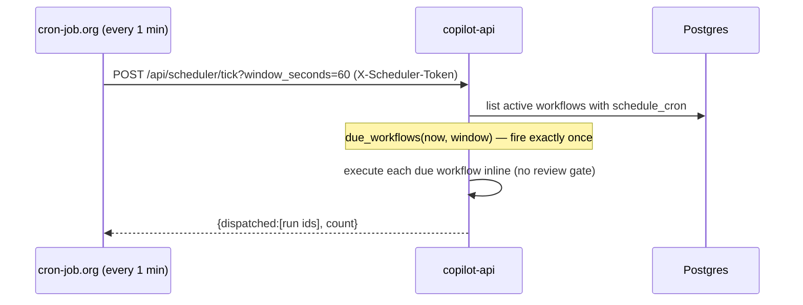

# How it works — end-to-end

This is the runtime walkthrough: what happens from typing a task to a delivered
result, how each subsystem fits together, and how the whole thing runs in production.

For _why_ the pieces were chosen see [decisions.md](decisions.md); for the static design
see [architecture.md](architecture.md); for scaling see [scalability.md](scalability.md).

---

## 1. The mental model

You describe a repetitive task in plain English. The system:

1. **Plans** it — an LLM turns the task into an ordered list of *typed steps*.
2. **Persists** it as a **Workflow** (steps you can edit in a visual editor).
3. **Runs** it — an executor runs each step in order, threading each step's output into
   the next, recording a **Run** with one **StepResult** per step.
4. **Pauses for review** before anything side-effecting (Slack/email) so you approve or
   edit first.
5. **Delivers** the result (Slack / email).
6. **Schedules** it to repeat, and **learns** from your 👍/👎 to improve future plans.

The guiding rule everywhere: **the LLM plans, deterministic code executes**, and
**every external provider hides behind an interface with an offline fake**, so the app
runs fully with zero API keys and turns "real" one env var at a time.

---

## 2. The core flow



### Step types

A plan is a list of typed steps; each maps to a **Tool** ([`app/tools`](../backend/app/tools)):

| Step | What it does | Offline fake | Real |
|------|--------------|--------------|------|
| `web_search` | find sources for a query | simulated results | Tavily API |
| `scrape` | fetch a URL → extract text | simulated page | real HTTP fetch (SSRF-guarded) |
| `retrieve` | RAG: pull relevant document chunks | hashing embedder | OpenAI embeddings |
| `summarize` | distill collected material | rule-based digest | Claude |
| `orchestrate` | researcher → summarizer → reviewer agents | deterministic team | Claude (per role) |
| `notify_slack` / `notify_email` | deliver the digest | records a preview | webhook / SMTP |

Each step reads earlier steps' outputs from a shared **context** dict (keyed by step
type) and writes its own — so `summarize`/`orchestrate` automatically ground on whatever
`web_search`, `scrape`, and `retrieve` produced upstream.

### The executor ([`app/execution/executor.py`](../backend/app/execution/executor.py))

- Runs steps in `order_index` order, each bounded by a timeout.
- **Retries** transient failures with exponential backoff; a `ToolError(retryable=False)`
  (e.g. missing config) fails fast.
- **Review gate:** when `require_review` is on, it stops at `awaiting_review` *before* the
  first side-effecting step. `approve` resumes with the (possibly edited) upstream output;
  `reject` cancels. Scheduled runs skip the gate (unattended).
- On the first failed step the run stops and is marked `failed`. Everything is recorded as
  a `Run` + `StepResult`s for history and the eval harness.

---

## 3. Subsystems

- **Planner** ([`app/llm`](../backend/app/llm)) — Claude tool-use returns a validated
  `WorkflowPlan`. `LLM_PROVIDER=fake` gives a deterministic offline planner. The
  **feedback loop** feeds recent 👍 plans back as few-shot examples so suggestions improve.
- **RAG** ([`app/rag`](../backend/app/rag)) — uploaded docs are text-extracted, chunked,
  embedded, and stored in a pgvector column; `retrieve` embeds the query and returns the
  nearest chunks by cosine similarity. Embedding runs off the event loop.
- **Multi-agent** ([`app/agents`](../backend/app/agents)) — the `orchestrate` step runs a
  researcher → summarizer → reviewer team (config-bounded review rounds), grounded on
  upstream material.
- **Feedback** ([`app/repositories/feedback.py`](../backend/app/repositories/feedback.py)) —
  👍/👎 on a workflow; positive ratings become planning exemplars.
- **Reliability** — structured JSON logs with request/run correlation ids; any unhandled
  error becomes a uniform safe `500`.
- **Eval harness** ([`app/eval`](../backend/app/eval)) — `python -m app.eval` scores plan
  quality + grounding (anti-hallucination) and gates CI.

### Data model

```
Workflow 1─┬─* Step        (the plan: typed, ordered)
           └─* Run 1─* StepResult   (each execution + per-step output)
Document 1─* DocumentChunk (content + embedding vector)
Feedback   (rating + task/plan snapshot → planning exemplar)
```

---

## 4. The provider / fake pattern

Every capability is an interface with a deterministic **fake** default and a **real**
implementation selected by config. If a real provider's key is missing, it **falls back
to the fake** and logs a warning — the app never hard-fails on missing config.

| Capability | Real version needs | Falls back to |
|------------|-------------------|---------------|
| Planner | `LLM_PROVIDER=anthropic` + `ANTHROPIC_API_KEY` | fake planner (or 503 if provider=anthropic w/o key) |
| Summarize / agents | `TOOLS_PROVIDER=live` + `ANTHROPIC_API_KEY` | deterministic fakes |
| Web search | `SEARCH_PROVIDER=tavily` + `TAVILY_API_KEY` | simulated results |
| Scrape | `TOOLS_PROVIDER=live` (no key) | simulated page |
| Embeddings | `EMBEDDING_PROVIDER=openai` + `OPENAI_API_KEY` | hashing embedder |
| Slack / email | `SLACK_WEBHOOK_URL` / SMTP vars | recorded preview |

This is why the same image runs in dev, CI, and prod: keys change behavior, not code.

---

## 5. How it runs in production (Render, free tier)

Three services from one Blueprint ([`render.yaml`](../render.yaml)): **frontend**,
**api**, **managed Postgres**. No worker, no Redis.



What's different from the full design, and why it still works:

- **Runs execute inline** (`RUN_ASYNC=false`). `POST /runs` runs the workflow in the
  request and returns the finished (or `awaiting_review`) run — no Celery worker/Redis to
  pay for. Fine because runs are short and the review gate is the natural pause point.
- **Migrations run on start** — the API container runs `alembic upgrade head` then serves
  ([`scripts/render-start.sh`](../backend/scripts/render-start.sh)), so the schema always
  matches the deployed code (single instance → no migration race).
- **Scheduling is worker-free** — instead of Celery Beat, a free external cron
  (cron-job.org) POSTs `/api/scheduler/tick` every minute with a shared `SCHEDULER_TOKEN`.
  The endpoint finds workflows whose `schedule_cron` is due in the window and runs them
  unattended. The token also keeps the free API warm (no cold start).
- **Graceful degradation** — with no provider keys the deployed app still works using the
  fakes (great for a demo). Add `ANTHROPIC_API_KEY` for real planning, `TAVILY_API_KEY`
  for real search, `OPENAI_API_KEY` for real embeddings, and Slack/SMTP for real delivery
  — each independently.



### Scaling beyond free

The design is platform-agnostic. To scale: run api behind a load balancer with multiple
replicas (move migrations to a one-off pre-deploy job), and enable the **optional async
path** — Celery worker + Redis with `RUN_ASYNC=true` — so long runs execute off the
request thread and scale by queue depth. See [scalability.md](scalability.md).

---

## 6. Local development

`./scripts/dev-local.sh` brings up Postgres (+pgvector), Redis, migrations, the API, a
Celery worker + Beat, and the frontend natively (no Docker). It exercises the **full async
path** (`RUN_ASYNC=true` + worker + Beat) — the richer architecture the free Render tier
trims. Stop with `./scripts/dev-local-stop.sh`. See the [root README](../README.md).
